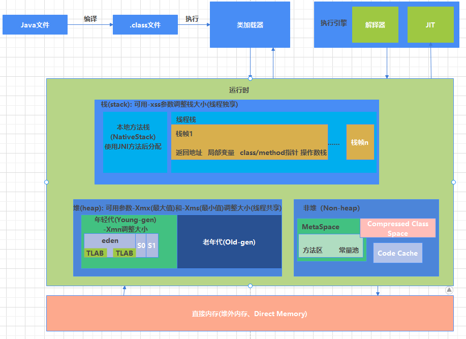

学习笔记

1. 自己写一个简单的 Hello.java，里面需要涉及基本类型，四则运行，if 和 for，然后 自己分析一下对应的字节码

   [分析字节码](https://github.com/vinceDa/JAVA-01/blob/main/Week_01/homework/%E5%AD%97%E8%8A%82%E7%A0%81%E5%88%86%E6%9E%90.md)

2. 自定义一个 Classloader，加载一个 Hello.xlass 文件，执行 hello 方法，此文件内容是一个 Hello.class 文件所有字节(x=255-x)处理后的文件

   [自定义ClassLoader](https://github.com/vinceDa/JAVA-01/blob/main/Week_01/homework/CustomClassLoader.java)

3. 画一张图，展示 Xmx、Xms、Xmn、Meta、DirectMemory、Xss 这些内存参数的 关系。

   

